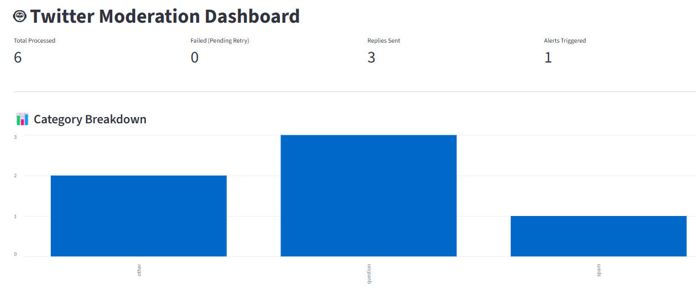
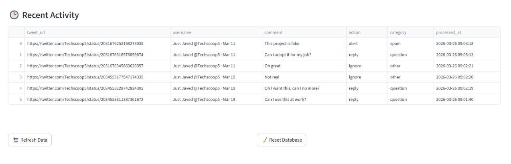

# 🤖 AI-Powered Twitter Moderation Agent

An autonomous AI system that monitors Twitter mentions, classifies content using LLMs, and takes real-time actions such as replying, alerting moderators, or ignoring content.

---

## 🚀 Features

- 🔍 Scrapes Twitter mentions using Playwright
- 🧠 Hybrid classification:
  - Rule-based filtering (harmful keywords)
  - LLM-based decision making (Groq)
- ⚡ Automated actions:
  - Reply to tweets
  - Send moderator alerts
  - Ignore benign content
- 🛠 Tool-calling architecture (MCP)
- 💾 SQLite tracking system:
  - Processed mentions
  - Failed mentions (retry queue)
- 🔁 Retry & fault-tolerant pipeline
- 📊 Monitoring dashboard (Streamlit)

---

## 🧠 System Architecture


## 🛠 Tech Stack

- Python
- Playwright (web scraping)
- Groq LLM (classification & reasoning)
- LangChain MCP (tool execution)
- SQLite (state management)
- Streamlit (dashboard)

---

## 📦 Installation

```bash
git clone https://github.com/yourusername/twitter-moderation-agent.git
cd twitter-moderation-agent

python -m venv .venv
.venv\Scripts\activate  # Windows

pip install -r requirements.txt
playwright install


🔐 Setup

Create a .env file:

GROQ_API_KEY=your_api_key
TELEGRAM_BOT_TOKEN=your_token
TELEGRAM_CHAT_ID=your_chat_id

🔑 Authentication

Generate Twitter session:

python login.py

This will create:

auth.json
▶️ Run the Agent
python -m Client.client
📊 Dashboard
streamlit run dashboard.py

Features:

Processed tweets
Failed tweets (retry queue)
Action breakdown (reply, alert)
Category insights
📁 Project Structure
.
├── Client/
│   └── client.py
├── servers/
│   ├── r_server.py
│   └── alert.py
├── database/
├── dashboard.py
├── auth.json
├── .env
└── README.md


🧪 Example Output
{
  "tool": "reply_to_tweet",
  "category": "question",
  "arguments": {
    "reply_text": "Thanks for reaching out! We'll assist shortly."
                }
}

🔥 Key Highlights
Real-time AI moderation system
Autonomous decision-making with LLMs
Fault-tolerant and stateful pipeline
Production-style architecture with observability
🚀 Future Improvements
FastAPI service layer
Redis queue (Celery workers)
Rate limiting & scaling
Model evaluation metrics


## 📸 Screenshots 
### 🖥 Moderation Visualization


### 📊 Moderation Table

👨‍💻 Author

Muhammad Suleiman
AI Engineer | LLM Systems | Automation